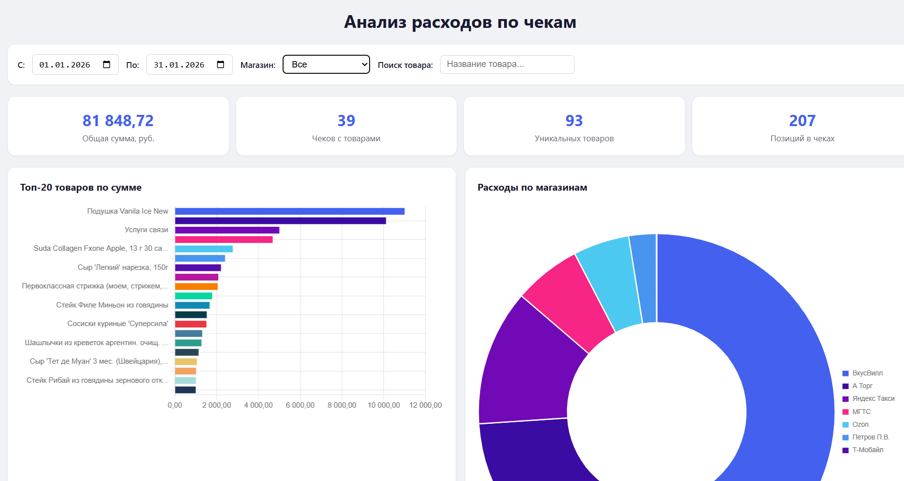

# ReceiptDownloader

Консольная утилита на C# для массовой выгрузки фискальных чеков из API ФНС (mco.nalog.ru).

## Назначение

Программа постранично запрашивает список чеков пользователя через API ФНС, затем для каждого чека загружает детальные фискальные данные и сохраняет их в отдельные JSON-файлы в папку `receipts/`. Уже загруженные чеки пропускаются, что позволяет запускать утилиту повторно для дозагрузки новых чеков.

## Требования

- .NET 10.0

## Использование

Передайте Bearer-токен авторизации первым аргументом командной строки или через переменную окружения `NALOG_TOKEN`:

```bash
dotnet run -- <bearer_token>
```

```bash
set NALOG_TOKEN=<bearer_token>
dotnet run
```

## Анализ расходов



Файл `index.html` — интерактивная веб-страница для визуального анализа загруженных чеков. Работает на данных из файла `data.js` (массив `RECEIPT_DATA`).

Возможности:

- Сводка: общая сумма, количество чеков, товаров и позиций
- Графики: топ-20 товаров по сумме, расходы по магазинам (кольцевая диаграмма), расходы по времени (день/неделя/месяц)
- Таблица всех товаров с сортировкой по колонкам
- Фильтры: период, магазин, поиск по названию товара

Для просмотра откройте `index.html` в браузере.

## Фильтрация дублей

По 54-ФЗ интернет-магазины выбивают два чека на одну покупку:

1. Чек предоплаты (`paymentType: 1`) — при получении денег.
2. Чек полного расчёта (`paymentType: 4`) — при передаче товара. Деньги не списываются повторно, вся сумма указана в поле `prepaidSum`.

При сборке `data.js` скрипт `build_data.js` пропускает чеки, у которых `prepaidSum >= totalSum`, чтобы не дублировать суммы в аналитике.

Значения `paymentType` (признак способа расчёта):

| Код | Значение |
|-----|----------|
| 1 | Предоплата 100% |
| 2 | Предоплата (частичная) |
| 3 | Аванс |
| 4 | Полный расчёт |
| 5 | Частичный расчёт и кредит |
| 6 | Передача в кредит |
| 7 | Оплата кредита |
